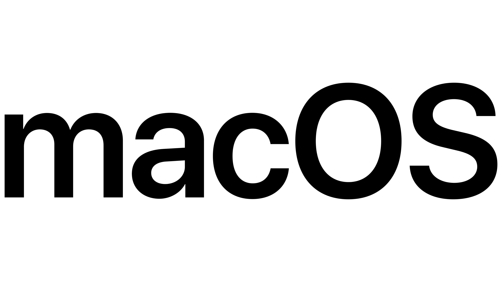

# ProyectoFinalSistemasOperativos
Integrantes: Jose Ricardo Holguin y Jorge Parra

## SISTEMAS OPERATIVOS

Un Sistema operative es uno o varios programas que permiten trabajar con uno o varios componentes de un computador o dispositivo.
Computadoras, celulares, relojes, televisores, hasta incluso refrigeradores.
La tendencia es que los sistemas operativos sean de mayor nivel, comandos de voz y que tengan una mayor velocidad para procesar datos.

### ¿Qué servicios ofrece un sistema operativo?
-	Iniciar una aplicación
-	Ejecutar un Comando
-	Abrir una carpeta
-	Abrir una página especifica de internet

## MANIPULACION DE ARCHIVOS Y DIRECTORIOS

Al decir manipular, nos referimos a identificación, creación, eliminación y reubicación de un archivo o directorio.
Algunos programas vistos para realizar estas acciones son GIT Bash, Powershell de Windows y la terminal Unix.

Cabe recalcar que Git Bash no es lo mismo que Github, siendo el primero un controlador de versiones y el segundo una plataforma online para repositorios.

## OPEN SOURCE

Es un software cuyo código fuente no es exclusivo de una persona u organización, sino todo lo contrario, es de dominio público.
Algunos ejemplos son Mozilla Firefox, Linux, VCL media player y Blender.

## HISTORIA DE LOS SISTEMAS OPERATIVOS

### Primer Nivel

Eran básicos, surgen en la década de los 50s, el lenguaje de programación que utilizaban era el FORTRAN, y se programaban en tarjetas perforadas.

## Segundo Nivel

Aparece en la década de los 60s, aumenta el rendimiento de los procesadores, que podían ser online u offline.

Aparece el buffering (los datos se pueden almacenar en memorias intermedias) y el spooling (los datos se almacenan en discos magnéticos)

### Tercer Nivel

Se crea en la década de los 70s, y trae consigo la creación de la multiprogramación, lo que permite a un solo procesador ejecutar varios programas.

### Cuarto Nivel

Aparece en la década de los 80s, hay una mejoría en la seguridad, ya que muchas computadoras se pueden conectar en paralelo y compartir su memoria y sus terminales.
Ahora las computadoras pueden tener más de un procesador.

### Quinto Nivel

Se implementan los sistemas operativos para dispositivos móviles.

## MACOS
-	Public Beta (2000) (X)
-	Felinos: Cheetah,Puma, Jaguar, Panther, Tiger, Leopard, Snow Leopard, Lion y Mountain Lion (2001-2013) (10.0 – 10.8)
-	Sitios de California: Mavericks, Yosemite, El Capitan, Sierra, High Sierra, Mojave, Catalina, Big Sur, Monterey, Ventura y Sononoma (2014-Hoy) (10.9 – 14)

## UBUNTU

-	Ha ido desde la versión 4 hasta la 23 que es la más actual
-	Utiliza código abierto
-	Es una bifurcación del Proyecto Debian GNU/Linux, su objetivo es que la distribución y entendimiento de dichos proyectos sea más fácil para los usuarios.

## WINDOWS

-	Windows 1,2,3 (1985-1987-1990)
-	Windows NT (1993)
-	Windows 95,98 ,2000 (1995-1998-2000)
-	Windows ME, XP, VISTA (2000-2001-2007)
-	Windows 7,8,10,11 (2009-2012-2015-2021)

## COMANDOS BASICOS UNIX

-	Cd: Cambiar de directorio
-	Cd NewFolder: Crea un nuevo directorio en la ruta actual
-	History: historial de comandos utilizados
-	Rm FileName: elimina un archivo con el nombre seleccionado
-	Vim FileName: Abrir un archivo con el editor vim
-	Ls: muestra los archivos en la ruta actual
-	Touch FileName: Crea un archive con el nombre indicado
-	Pwd: imprime la ruta actual en la que está el usuario
-	Make directoryname: Crea una carpeta con el nombre indicado
-	Git init: inicia un repositorio git
-	Git add . : agrega todos los cambios hechos en el repositorio de la maquina local
-	Git commit -m “mensaje”: guarda un mensaje al cambio hecho en el repositorio
-	Git push: sube los cambios hechos remotamente al repositorio a github

## DISPOSITIVOS DE ENTRADA Y SALIDA

Un dispositivo no puede hacer de todo, para eso existen dispositivos de entrada, salida y mixtos.

### Entrada
Los dispositivos de entrada mandan información hacia el dispositivo, 

### Salida
Los de salida expresan información que el dispositivo le manda al usuario 

### Mixtos
los mixtos hacen ambas cosas.

## PROCESOS

Es la ejecución de un programa individual, es una serie de instrucciones que el procesador debe ejecutar

### ESTADOS
Un proceso puede estar en varios estados: 
-	Nuevo
-	Listo
-	En Ejecución
-	Bloqueado
-	Zombie
-	Terminado

## ALGORITMO DE PLANEACION

Es la manera en que un CPU ejecuta varios procesos al mismo tiempo, asignándoles un tiempo de ejecución a cada proceso dependiendo del tipo de algoritmo utilizado.

-	Round Robin: Colocan todos los métodos de un grupo de manera equitativa, estableciendo un tiempo al cual dedicarle a cada uno de los métodos, si el tiempo se termina sin haber terminado el proceso, entonces se vuelve a intentar después de haber pasado por los demás procesos del grupo.
-	FCFS: First Come First Serve, se refiere a que el primer proceso que llega se le ejecutara, independientemente del tiempo que tome terminarlo, se ejecutan en el orden en el que llegan.
-	SJF: Shortest Job First, se refiere a que se acomodan los proceso dependiendo de la cantidad de tiempo que tardan en ejecutarse, poniendo los procesos mas cortos primero y los más tardados al último.

## ALMACENAMIENTO
-	Bit (b)
-	Byte (B) – 8 Bit
-	Kilobyte (Kb) – 1024 Bytes
-	Megabyte (Mb) – 1024 Kb
-	Gigabyte (Gb) – 1024 Mb
-	Terabyte (Tb) – 1024 Gb

## JERARQUIA DE MEMORIA 
La jerarquía de memoria es una estructura organizativa que se encuentra en casi todas las computadoras y sistemas informáticos. Esta jerarquía consiste en diferentes niveles de memoria con diferentes características en términos de capacidad  

- RAM - Random Access Memory
- Memoria caché
- Memoria secundaria o de almacenamiento

### Volatil y no volatil

*Memoria Volátil:*
- La memoria volátil pierde su contenido cuando se corta la energía

*Memoria No Volátil:*
-  La memoria no volátil retiene la información incluso cuando no hay energía
  

# Ejemplos de Virtualización del CPU, Virtualización de Memoria, Concurrencia, Persistencia  

## Virtualización del CPU:
- Un ejemplo de la virtualizacion del cpu es VirtualBox que permitan ejecutar varios sistemas operativos en un solo hardware fisico y los recursos del cpu se virtualizan y puedes asigar determinados nucleos, memoria y almacenamiento a estos   

## Virtualización de Memoria:
- La virtualización de memoria se utiliza en sistemas operativos para asignar direcciones de memoria virtuales a direcciones físicas reales. Por ejemplo, cuando un programa se ejecuta, puede tener acceso a un espacio de memoria mucho mayor que el disponible físicamente  
## Concurrencia:
- Un ejemplo común de concurrencia es un sistema operativo multitarea que ejecuta múltiples procesos al mismo tiempo. Por ejemplo, un sistema operativo permite a un usuario escuchar música, navegar por internet y editar un documento

## Persistencia:
- En el contexto de las bases de datos, la persistencia se refiere a la capacidad de almacenar datos de manera permanente incluso después de que el programa o el sistema se apaguen
- Ejemplo MySQL
  

# Personajes importantes para los sistemas operativos  

## Linus Torvalds
- Linus Torvalds es reconocido por haber creado el kernel del sistema operativo Linux, una de las bases fundamentales de muchos sistemas operativos modernos  

## Denis Ritchie
- Denis Ritchie es conocido por ser el creador del lenguaje de programación C y por ser uno de los desarrolladores fundamentales del sistema operativo UNIX. Su trabajo en el diseño del lenguaje C y su contribución al desarrollo de UNIX  

# Instrucciones para instalar Linux o como instalar una nueva versión de Mac  

## Instalar linux
- Descargar una distribución de Linux: Descarga la imagen ISO de la distribución que elijas
- Crear un medio de instalación: Graba la imagen ISO en un USB o DVD
- Arrancar desde el medio de instalación: Configura la BIOS para arrancar desde el USB o DVD
- Instalar Linux: Sigue las instrucciones del asistente de instalación
- Configurar y finalizar: Configura tu cuenta y ajustes post-instalación  

## Actualización de macOS:
- Respalda tus datos: Haz una copia de seguridad de tus datos
- Verifica la compatibilidad: Asegúrate de la compatibilidad con tu Mac
- Descarga la nueva versión de macOS: Desde la App Store, descarga la versión de macOS
- Iniciar la instalación: Sigue las instrucciones para iniciar la actualización.
- Configura y finaliza: Realiza la configuración inicial y restaura datos si es necesario  
